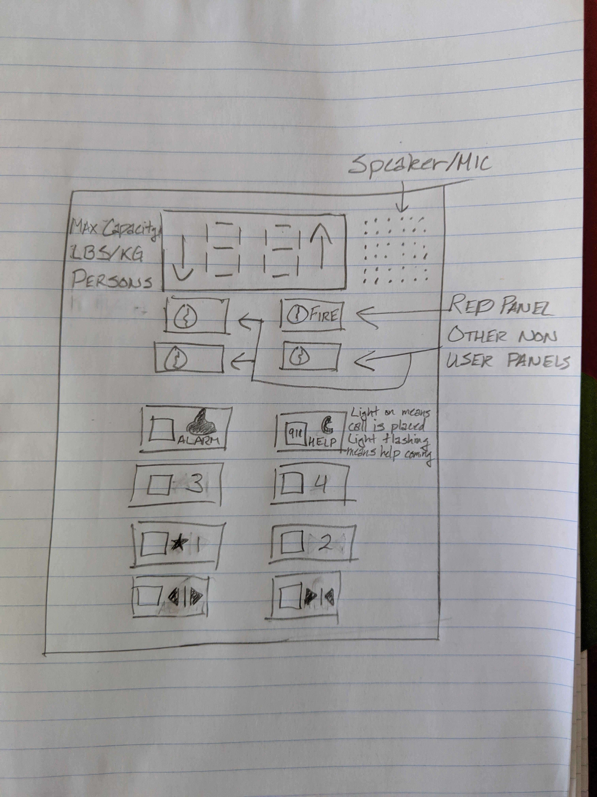
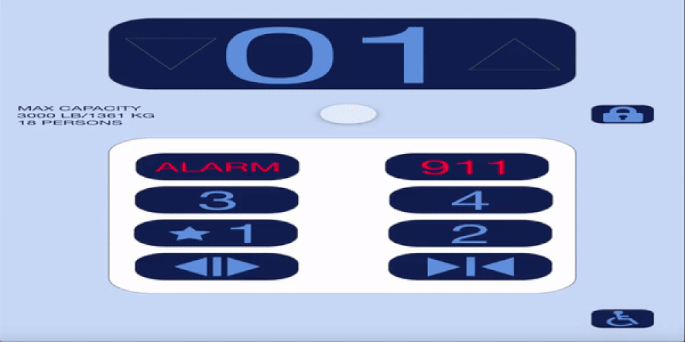

# Elevator-Interface

**Control Interface**

**Operation of Control Interface**

**Issues with Control Interface**

- The outside interface does not light up when pressed
- The outside interface does not have audio
- The inside interface does not indicate the direction
- The inside interface does not have audio

**Explanation**

- If the interface does not light up, the user is unsure if the button was pressed properly
- If the interface does not have audio, the user is unsure if the button was pressed properly
- If the interface does not indicate the direction, the user is unsure if the elevator is
  moving the same direction he/she wants to go

**Common/Rare Uses**

- To travel vertical distances in a building
- If I am physically unable to walk up/down the stairs
- Yes it does. I just have to click a couple buttons to move up or down various floors of a building

**Sequence of Actions**

1. Click up or down button on the outside interface
2. Enter the elevator
3. Click the desired floor to travel to
4. Click the close door button (even if it doesn't really work)
5. Exit once the elevator stops and the door opens

**How does the elevator support the user figure out how to make it work?**

The elevator helps the user by having a straightforward interface that requires little to no
instruction. For example, it has simple buttons with arrows next to them to indicate the
direction the elevator will move when that button is pressed. It also has numbers next to the
buttons to indicate what floor the elevator will travel to when that button is pressed.

**How does the elevator provide feedback to the user?**

The most common ways an elevator provides feedback is by having the button light up when
pressed which indicates that it is in operation, as well as providing audio cues to notify the
user when the elevator has arrived at a destination.

**Common Mistakes**

- It is easy for a child to hit the alarm or call button because it is as at the bottom
- It is easy to miss your floor if you're not paying attention due to the lack of audio cues
- It is easy to get on the wrong elevator because it does not display the direction the
  elevator is traveling on the inside interface

**Improved Control Interface**

The screen at the top supports buildings with up to 99 stories and clearly show the
direction the elevator is moving with the arrows on the left/right side. On the left side of
the screen will be a label that indicates the max capacity of the elevator. On the right side
will be the speaker for user feedback, that doubles as a microphone for emergency calls.

The bottom two buttons will be for opening and closing the elevator doors. The buttons above
those two will be for the various floors. Then the top two buttons will be for the bell alarm
and for calling 911 for emergencies. All buttons will light up and will give an audio cue
when pressed. The labels are next to the buttons to avoid wear and tear of users pressing the
buttons. The alarm and call button are at the top to avoid accidental presses by children.
The call button will be fully lit when a call is placed and will flash when help is on the way,
as clearly labeled next to the button.

Between the screen and buttons are various panels used by non-normal users, such as
repair men or firemen. Because these panels are used less often compared to the buttons
and also require a key to, they should be placed in an area less likely to be used.

**Touchscreen Design Implementation Prototype**

It will have a diagonal length of 11 inches, so the size will be close to the iPad Pro,
which could provide a sense of familiarity to the user.

[Touchscreen Design Implementation Prototype](https://xd.adobe.com/view/924456c4-cbc2-4919-4263-eaa7eccc3970-e475/?hints=off)

Because this just a prototype, the interface is not fully functional but is functional enough
to demonstrate the design and implementation. The following instructions will help you go
through the interface to understand its functionalities.

1. Sign into Adobe, if you do not have an account you must make one. You may also sign
   in with Google or Facebook. This is necessary to hear the audio feedback.
2. Press the third floor button. This demonstrates the interface as the elevator moves
   upwards.
3. Press the second floor button. This demonstrates the interface as the elevator moves
   downwards.
4. At this point five different buttons work, lock, 911, open door, close door, and
   wheelchair accessibility.
   - Press the lock button to access a new menu meant for maintenance workers or firemen.
     Pressing any of the four main menu buttons will display a keypad meant for passwords that
     only the restricted access people will know. Those buttons do not work at the moment.
     The back arrow in the top right will take you back to the screen prior.
   - Press the 911 button to call for emergency help. Pressing it once will turn the text color
     to red which means the call is active. A hangup button will also appear to stop the call
     if the button was pressed accidentally. After a few seconds, the box will turn red
     simulating the call is over and help is on the way. The hangup button will take you back
     to the main elevator screen.
   - Press the open and close door button to see that there is visual feedback when they are
     pressed.
   - Press the wheelchair button to change the layout of the main elevator interface. This
     interface will allow people in wheelchairs to press the button that might have been
     too high to press prior to changing to the wheelchair accessibility mode. The left and right
     arrows will scroll through the floors that aren't currently visible. If the arrow does not
     change color that means there aren't any more floors in that direction.
     1. Press the third floor button. This demonstrates the interface as the elevator moves
        upwards in this new interface.
     2. Press the back arrow in the bottom right corner to return to the normal elevator interface.
     3. End of prototype.

Gif of interface in action

