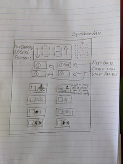

# Elevator-Interface

**Control Interface**

**Operation of Control Interface**

**Issues with Control Interface**

- The outside interface does not light up when pressed
- The outside interface does not have audio
- The inside interface does not indicate the direction
- The inside interface does not have audio

**Explanation**

- If the interface does not light up, the user is unsure if the button was pressed properly
- If the interface does not have audio, the user is unsure if the button was pressed properly
- If the interface does not indicate the direction, the user is unsure if the elevator is
  moving the same direction he/she wants to go
- If the interface does not have audio, the user is unsure if the button was pressed properly

**Common/Rare Uses**

- To travel vertical distances in a building
- If I am physically unable to walk up/down the stairs
- Yes it does. I just have to click a couple buttons to move up or down various floors of a building

**Sequence of Actions**

1. Click up or down button on the outside interface
2. Enter the elevator
3. Click the desired floor to travel to
4. Click the close door button (even if it doesn't really work)
5. Exit once the elevator stops and the door opens

**How does the elevator support the user figure out how to make it work?**

The elevator helps the user by having a straightforward interface that requires little to no
instruction. For example, it has simple buttons with arrows next to them to indicate the
direction the elevator will move when that button is pressed. It also has numbers next to the
buttons to indicate what floor the elevator will travel to when that button is pressed.

**How does the elevator provide feedback to the user?**

The most common ways an elevator provides feedback is by having the button light up when
pressed which indicates that it is in operation. Elevators also audio cues to notify the
user when the elevator has arrived at a destination.

**Improved Control Interface**

The screen at the top supports buildings with up to 99 stories and clearly show the
direction the elevator is moving with the arrows on the left/right side. On the left side of
the screen will be a label that indicates the max capacity of the elevator. On the right side
will be the speaker for user feedback, that doubles as a microphone for emergency calls.

The bottom two buttons will be for opening and closing the elevator doors. The buttons above
those two will be for the various floors. Then the top two buttons will be for the bell alarm
and for calling 911 for emergencies. All buttons will light up and will give an audio cue
when pressed. The labels are next to the buttons to avoid wear and tear of users pressing the
buttons. The alarm and call button are at the top to avoid accidental presses by children.
The call button will be fully lit when a call is placed and will flash when help is on the way,
as clearly labeled next to the button.

Between the screen and buttons are various panels used by non-normal users, such as
repair men or firemen. Because these panels are used less often compared to the buttons
and also require a key to, they should be placed in an area less likely to be used.

**Touchscreen Design Implementation Prototype**
It will have a diagonal length of 11 inches, so the size will be close to the iPad Pro,
which could provide a sense of familiarity to the user.
[Touchscreen Design Implementation Prototype](https://xd.adobe.com/view/924456c4-cbc2-4919-4263-eaa7eccc3970-e475/?hints=off)
